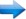

[//]: # (Image References)
[image_0]: ./misc/rover_image.jpg

# Project: 3D Perception

### Exercise 1, 2 and 3 Pipeline Implementation

#### Excecise 1: Filtering and RANSAC plane fitting

The pipeline for this part of the project is as teh following:

Voxel Grid Filter   Pass through 'Z' axis   Pass through 'Y' axis    Outlier filtering  
RANSAC plane fitting 

