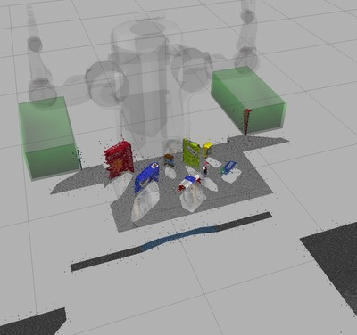
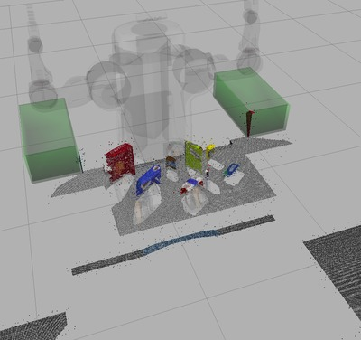
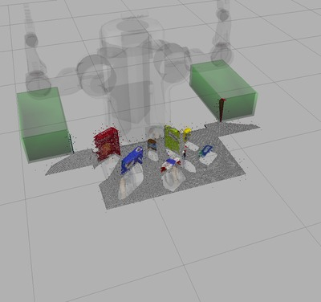
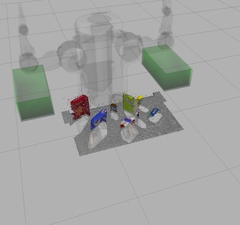
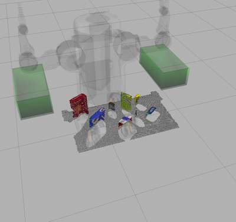
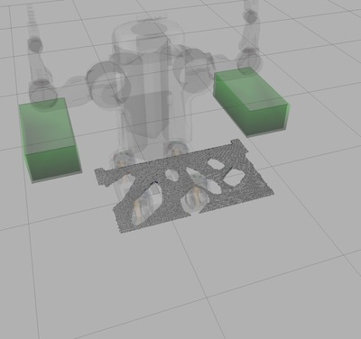
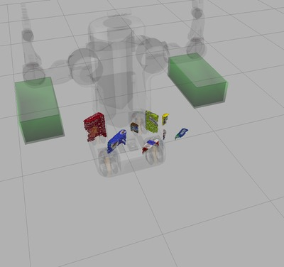
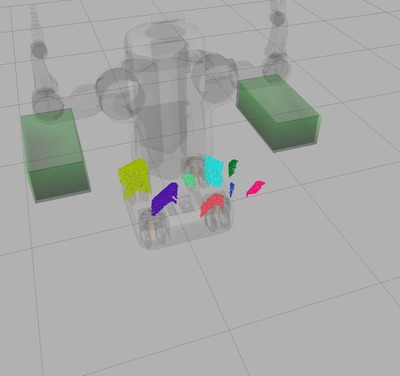

[//]: # (Image References)
[image_0]: ./misc/rover_image.jpg

# Project: 3D Perception

### Exercise 1, 2 and 3 Pipeline Implementation

#### Excecise 1: Filtering and RANSAC plane fitting

The pipeline for this part of the project is as the following:

Voxel Grid Filter   Pass through 'Z' axis   Pass through 'Y' axis    Outlier Filter  
RANSAC Plane Fitting 

The results of the filters in the pipline and a short description are provieded in the following:

Output Image          | Description
:---------------------|:-------------------
   | **RGB-D camera point cloud**: The original point cloud is obtained by subscribing to `/pr2/world/points` topic. 
   | **Vox Grid Filter**: Vox filter is used to reduce the size of input data and lower the overal computational overhead. Lead size is set to 0.005 to have enough details for the next steps.
   |	**Pass through 'Z' axis**: This pass through in 'Z' axis is perfromed with the min and max parameter values of 0.6 and 1.1 respectively.
   |	**Pass through 'Y' axis**: This pass through in 'Y' axis is perfromed with the min and max parameter values of -0.5 and 0.5 respectively. 
   |	**Outlier Filter**: Outlier filter is performed to remove point cloud scatter noise seen in the previous images. 50 neighboring point average is caluclued and outlier are filterd by the threshold scale factor set to 0.25.
   | **RANSAC inliers**: The table surface is extracted by the RANSAC plane fitting algorithm. The inliner points are the table surface plane. maximium distance threshold is set to 0.01.
   |	**RANSAC outliers**: The objects on the table are extracted by sybstricting table surface points from the filtered point cloud.

#### Exercies 2: Clustering for segmentation

The object point cloud should be segmented in order to detect indivutial objects. Eucleadan clustering algorithm is used for this purpose. A k-d three is constructed to search for neighboring points. The clustering algorithm patameter values are:
- Cluster tolerance : 0.05
- Maximum cluster size: 10
- Minimum cluster size: 3000

In the following image the result of the clustering step is shown. Different clusters are assigned differernt colors.

#### Exercise 3: Features extraction, SVM training and Object recognition implementation

