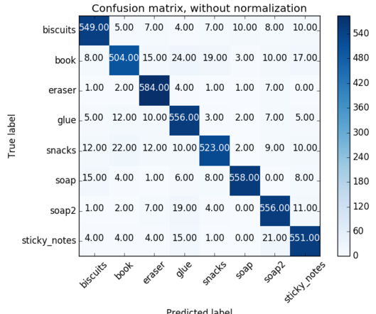

[//]: # (Image References)
[image_0]: ./misc/rover_image.jpg
[](https://www.udacity.com/robotics)
# Project: 3D Perception

### Exercise 1, 2 and 3 Pipeline Implementation

#### Exercise 1: Filtering and RANSAC plane fitting

The pipeline for this part of the project is as the following:

Voxel Grid Filter <sub> </sub> Pass through 'Z' axis <sub> </sub> Pass through 'Y' axis  <sub> </sub> Outlier Filter <sub> </sub>
RANSAC Plane Fitting 

The results of the filters in the pipeline and short descriptions for all the steps are provided in the following:

Result&nbsp;&nbsp;&nbsp;&nbsp;&nbsp;&nbsp;&nbsp;&nbsp;&nbsp;&nbsp;&nbsp;&nbsp;&nbsp;&nbsp;&nbsp;&nbsp;&nbsp;&nbsp;&nbsp;&nbsp;&nbsp;&nbsp;&nbsp;&nbsp;&nbsp;&nbsp;&nbsp;&nbsp;&nbsp;&nbsp;&nbsp;&nbsp;&nbsp;&nbsp;&nbsp;&nbsp;&nbsp;&nbsp;&nbsp;&nbsp;&nbsp;&nbsp;&nbsp;&nbsp;&nbsp;&nbsp;&nbsp;&nbsp;&nbsp;&nbsp;&nbsp;&nbsp;&nbsp;&nbsp;&nbsp;&nbsp;&nbsp;&nbsp;&nbsp;&nbsp;&nbsp;&nbsp;&nbsp;&nbsp;&nbsp;&nbsp;&nbsp;&nbsp;&nbsp;&nbsp;&nbsp;&nbsp;&nbsp;&nbsp;&nbsp;&nbsp;&nbsp;&nbsp;&nbsp;&nbsp;&nbsp;&nbsp;&nbsp;&nbsp;&nbsp;&nbsp;&nbsp;&nbsp;|Description
:---------------------|:-------------------
   | **RGB-D camera point cloud**: The original point cloud is obtained by subscribing to `/pr2/world/points` topic. 
   | **Vox Grid Filter**: Vox filter is used to reduce the size of input data and lower the overall computational overhead. Lead size is set to 0.005 to have enough details for the next steps.
   |**Pass through 'Z' axis**: This pass through in 'Z' axis is performed with the min and max parameter values of 0.6 and 1.1 respectively.
   |**Pass through 'Y' axis**: This pass through in 'Y' axis is performed with the min and max parameter values of -0.5 and 0.5 respectively. 
   |**Outlier Filter**: Outlier filter is performed to remove point cloud scatter noise seen in the previous images. 50 neighboring point average is calculated and outlier are filtered by the threshold scale factor set to 0.25.
   | **RANSAC inliers**: The table surface is extracted by the RANSAC plane fitting algorithm. The inliner points are the table surface plane. maximum distance threshold is set to 0.01.
   |**RANSAC outliers**: The objects on the table are extracted by subtracting table surface points from the filtered point cloud.

#### Exercise 2: Clustering for segmentation

The object point cloud should be segmented in order to detect individual objects. Euclidean clustering algorithm is used for this purpose. A k-d three is constructed to search for neighboring points. The clustering algorithm parameter values are:
- Cluster tolerance : 0.05
- Maximum cluster size: 10
- Minimum cluster size: 3000

In the following image the result of the clustering step is shown. Different clusters are assigned different colors.


#### Exercise 3: Features extraction, SVM training and Object recognition implementation

The HSV and normal vector histograms are used as the features to classify objects in the scene. 

Function `compute_color_histograms` calculates HSV values, constructs the histogram and normalizes the combined feature vector as following:
```python
def compute_color_histograms(cloud, using_hsv=False, nbins=64, bins_range=(0,256)):

    # Compute histograms for the clusters
    point_colors_list = []

    # Step through each point in the point cloud
    for point in pc2.read_points(cloud, skip_nans=True):
        rgb_list = float_to_rgb(point[3])
        if using_hsv:
            point_colors_list.append(rgb_to_hsv(rgb_list) * 255)
        else:
            point_colors_list.append(rgb_list)

    # Populate lists with color values
    channel_1_vals = []
    channel_2_vals = []
    channel_3_vals = []

    for color in point_colors_list:
        channel_1_vals.append(color[0])
        channel_2_vals.append(color[1])
        channel_3_vals.append(color[2])
    
    # Compute the histogram of the HSV channels separately
    ch1_hist = np.histogram(channel_1_vals, bins=nbins, range=bins_range)
    ch2_hist = np.histogram(channel_2_vals, bins=nbins, range=bins_range)
    ch3_hist = np.histogram(channel_3_vals, bins=nbins, range=bins_range)

    # Concatenate the histograms into a single feature vector
    hist_features = np.concatenate((ch1_hist[0], ch2_hist[0], ch3_hist[0])).astype(np.float64)
    # Normalize the result
    normed_features = hist_features / np.sum(hist_features)

    return normed_features 
```
Function `compute_normal_histograms` is similar to `compute_color_histograms` and performs the same operations on the calculated normal vectors of the 3D point cloud:

```python
def compute_normal_histograms(normal_cloud, nbins=64, bins_range=(-1,1)):
    norm_x_vals = []
    norm_y_vals = []
    norm_z_vals = []

    for norm_component in pc2.read_points(normal_cloud,
                                          field_names = ('normal_x', 'normal_y', 'normal_z'),
                                          skip_nans=True):
        norm_x_vals.append(norm_component[0])
        norm_y_vals.append(norm_component[1])
        norm_z_vals.append(norm_component[2])

    # Compute the histogram of the HSV channels separately
    ch1_hist = np.histogram(norm_x_vals, bins=nbins, range=bins_range)
    ch2_hist = np.histogram(norm_y_vals, bins=nbins, range=bins_range)
    ch3_hist = np.histogram(norm_z_vals, bins=nbins, range=bins_range)

    # Concatenate the histograms into a single feature vector
    hist_features = np.concatenate((ch1_hist[0], ch2_hist[0], ch3_hist[0])).astype(np.float64)
    # Normalize the result
    normed_features = hist_features / np.sum(hist_features)

    return normed_features 
```

These functions are used in `capture_script.py` script to generate feature vectors for the eight objects in the pick and place project in random different views. It is observed that the precision of the classifier can be increased by increasing the number of random viewing angles. Therefore, the feature vectors are captured for 600 different views in `caputre_script.py` script for each object:

```python
    for model_name in models:
        spawn_model(model_name)

        for i in range(600):
            # make five attempts to get a valid a point cloud then give up
            sample_was_good = False
            try_count = 0
            while not sample_was_good and try_count < 5:
                sample_cloud = capture_sample()
                sample_cloud_arr = ros_to_pcl(sample_cloud).to_array()

                # Check for invalid clouds.
                if sample_cloud_arr.shape[0] == 0:
                    print('Invalid cloud detected')
                    try_count += 1
                else:
                    sample_was_good = True

            # Extract histogram features
            chists = compute_color_histograms(sample_cloud, using_hsv=True)
            normals = get_normals(sample_cloud)
            nhists = compute_normal_histograms(normals)
            feature = np.concatenate((chists, nhists))
            labeled_features.append([feature, model_name])
```

The results are saved in a pickle file which is used to train the SVM model. `train_svm.py` script loads this pickle file and trains a linear SVM classifier. The confusion matrices obtained by a 5-fold cross-validation are shown in the following figures:


 | 
--|--

The overall accuracy is reported as 91%. The trained SVM model is saved to a pickle file and is used in the `pcl_callback()` function to classify the segmented point cloud clusters:

```python
#... inside the main function:

    model = pickle.load(open('model.sav', 'rb'))
    clf = model['classifier']

#... inside the pcl_callback():

    for index, pts_list in enumerate(cluster_indices):
        # Grab the points for the cluster
        pcl_cluster = extracted_outliers.extract(pts_list)
        ros_cluster = pcl_to_ros(pcl_cluster)

        # Extract histogram features
        chists = compute_color_histograms(ros_cluster, using_hsv=True)
        normals = get_normals(ros_cluster)
        nhists = compute_normal_histograms(normals)
        feature = np.concatenate((chists, nhists))

        # Make the prediction, retrieve the label for the result
        # and add it to detected_objects_labels list
        prediction = clf.predict(scaler.transform(feature.reshape(1,-1)))
        label = encoder.inverse_transform(prediction)[0]
        detected_objects_labels.append(label)

#       ...

        # Add the detected object to the list of detected objects.
        do = Detected Object()
        do.label = label
        do.cloud = ros_cluster
        detected_objects.append(do)
```

### Pick and Place Setup

After segmentation of input point cloud into disjoints clusters and classify each cluster, detected objects are matched against the objects in picklist and the output yaml file is created. For each detected object, different ROS messages are populated and a yaml friendly dictionary is constructed. The constructed dictionaries are saved in the output yaml file. The python implementation of the mentioned operations is as following:
```python
# create yaml dictionary
dict_list = []
for i in range(0, len(object_list_param)):
    # Populate various ROS messages
    test_scene_num = Int32()
    arm_name = String()
    object_name = String()
    pick_pose = Pose()
    place_pose = Pose()

    test_scene_num.data = 3
    arm_name.data = 'right' if object_list_param[i]['group'] == 'green' else 'red'
    object_name.data = object_list_param[i]['name']
    for j in range(len(labels)):
        if labels[j] == object_list_param[i]['name']:
            pick_pose.position.x = float(centroids[j][0])
            pick_pose.position.y = float(centroids[j][1])
            pick_pose.position.z = float(centroids[j][2])
            break;
    place_position = right_centroid if object_list_param[i]['group'] == 'green' else left_centroid    
    place_pose.position.x = float(place_position[0])
    place_pose.position.y = float(place_position[1])
    place_pose.position.z = float(place_position[2])

    yaml_dict = make_yaml_dict(test_scene_num, arm_name, object_name, pick_pose, place_pose)
    dict_list.append(yaml_dict)

send_to_yaml('output_3.yaml', dict_list)
```

The screenshots for each different world is shown below:


 |  |  
---------------------------|----------------------------|----------------------------
World 1                    | World 2                    | World 3

The only issue is that the glue is mostly recognized as biscuits. Therefore, the implemented recognition algorithm accuracy is as following:


World 1                    | World 2                    | World 3
---------------------------|----------------------------|----------------------------
3/3 (100%)                 | 4/5 (80%)                  | 7/8 (88%)


### Future works

As it is discussed in the previous section, the recognition algorithm accuracy is limited while the classification problem is not really complicated. Tuning the hyper parameters, using RBF kernel for SVM classifier and increasing the number of captured features are all tried out and could not completely eliminate the classifaciton errors. To improve the accuracy, adding more features such as dimesions or volume of the clusters might be a path to follow. The other solution might be trying out different classification algorithms.


